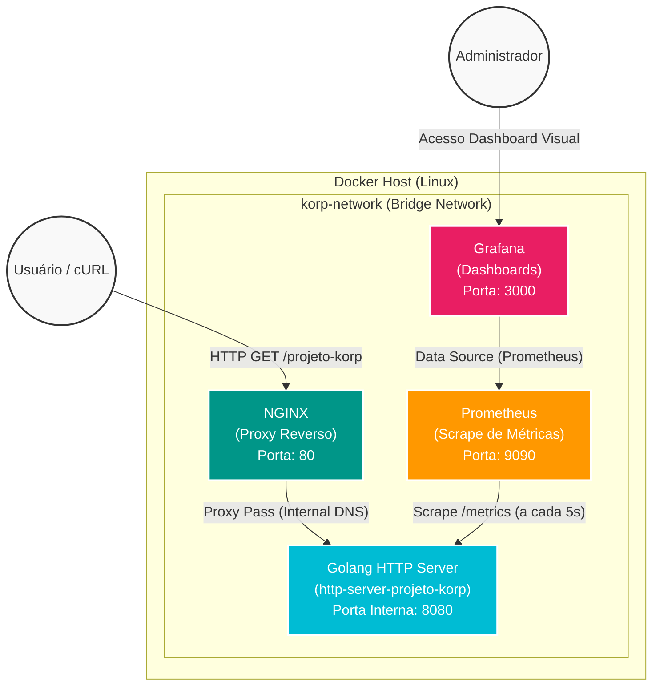
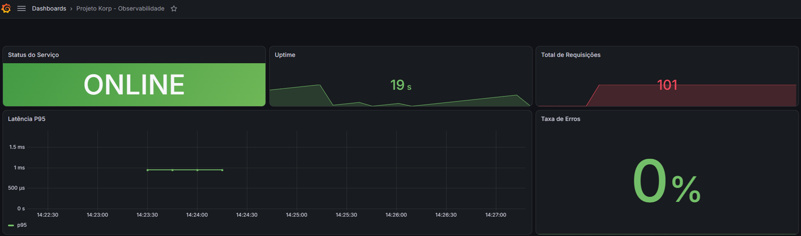

<h1 align="center">🚀 Projeto Korp - Desafio DevOps</h1>

<p align="center">
  Bem-vindo ao repositório do <b>Projeto Korp</b>! Este projeto foi desenvolvido como solução para o desafio de DevOps, demonstrando habilidades em programação (Golang), containerização (Docker), automação de infraestrutura (Ansible) e observabilidade (Prometheus e Grafana).
</p>

---

## 🏗️ Arquitetura do Projeto

Abaixo apresento o diagrama da arquitetura implementada. A aplicação foi isolada em uma rede Docker privada, e o acesso externo ocorre única e exclusivamente através do **NGINX** (Proxy Reverso).



---

## 📁 Estrutura de Diretórios

Toda a organização do código foi pensada para ser modular, seguindo boas práticas do mercado:

- 📂 **`ansible/`**: Contém a automação 100% da infraestrutura. O `playbook.yml` instala dependências, baixa o Docker, cria a rede, faz o build da aplicação, sobe os containers e executa testes de validação no final.
- 📂 **`app/`**: Código-fonte da aplicação Golang. Utiliza um **Dockerfile Multi-stage** com a imagem `scratch` para gerar um container minimalista (menos de 10MB) e extremamente seguro (rodando com um usuário não-root).
- 📂 **`docker/`**: Infraestrutura da aplicação. 
  - O `docker-compose.yml` orquestra todos os serviços.
  - O diretório `nginx/` contém a configuração de Proxy Reverso (`http-server-projeto-korp.conf`).
  - O diretório `prometheus/` possui o arquivo de scrape (`prometheus.yml`).
- 📂 **`grafana/`**: Provisionamento automático. Quando o Grafana sobe, ele já carrega o DataSource do Prometheus e o Dashboard que foi desenhado em JSON, sem a necessidade de nenhum clique ou configuração manual na interface.

---

## 📊 Observabilidade (Monitoramento)

O monitoramento é um dos grandes destaques do projeto. A aplicação Golang expõe nativamente duas métricas através da biblioteca do Prometheus, que são processadas em tempo real pelo Grafana:
1. **Disponibilidade (`service_up`)**: Informa se o serviço está operante (1 = UP, 0 = DOWN).
2. **Volume de Requisições (`http_requests_total`)**: Um contador do total de chamadas feitas à API.



---

## 🚀 Como Executar

Toda a stack de infraestrutura é provisionada de forma totalmente automatizada. Em uma máquina Linux, basta rodar o comando único Ansible:

```bash
cd ansible
ansible-playbook -i inventory playbook.yml
```
> **Nota:** Se seu `sudo` pedir senha, use `ansible-playbook -i inventory playbook.yml -K` e informe a senha.

### Validação
Após a execução do Ansible, você pode testar a disponibilidade do serviço no seu terminal:

```bash
curl http://localhost:80/projeto-korp
```
**Resposta esperada (com o horário dinâmico UTC):**
```json
{
  "nome": "Projeto Korp",
  "horario": "2026-09-01T15:00:00Z"
}
```

Para interagir com o monitoramento, acesse `http://localhost:3000` no seu navegador (Usuário padrão: `admin` / Senha: `admin`).
